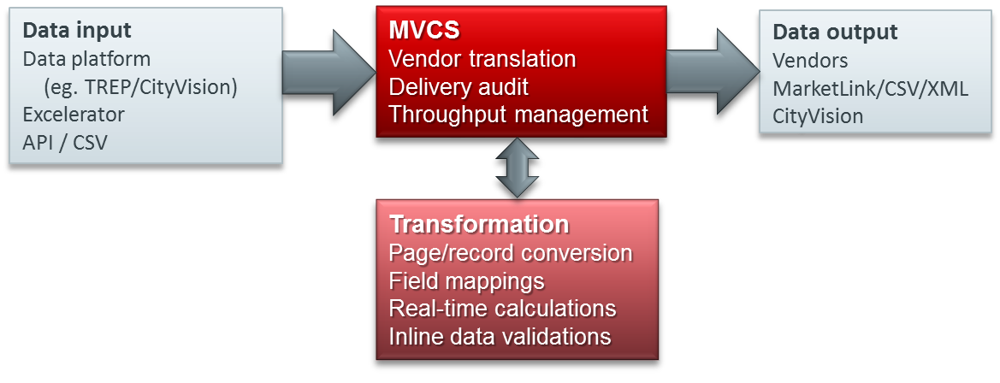

---

# Overview

+++

# Introduction

* Leading independent provider of market data technology
* Client base includes Cental + Tier 1 investment banks, brokers
* Listed on London Stock Exchange (AIM)

---

# Product Lines 

+++

# Server-side

* MVCS - Centralised real-time data contribution
* Cache - Market data rules engine
* Symbol mapper - Identifier and field normalisation

+++

# Client-side

* Excelerator - Real-time market data subscription, calculation,
publishing.
* Excelerator Desktop - Excelerator plus Desktop Display.

---

# Arcontech Platform

+++

# Arcontech Platform

---

# CityVision MVCS

+++

# CityVision MVCS

* Vendor independent distribution with destination neutrality
* Data output to single or multiple destinations
* Support for records, pages and chains
* Data transformations – page/record conversion and field mappings
* Fully resilient, supporting hot standby mode
* Real-time control, configuration and contribution visibility
* Cross-platform support – Linux ,Windows, Solaris

+++

# CityVision MVCS

## Other Features

* Audit trail (inbound and outbound) for compliance and regulation
* Optimal handling of vendor throttling and conflation management
* Dynamic configuration allowing for system changes intraday
* High throughput / capacity. 
* Multithreaded with advanced memory optimisation
* API support via VBA, .NET, Java, C#, C++
* Large chain support allowing bulk dynamic data routing
* Instrument name and field mapping per destination
* Inline data validations – eg. spikes / backwardation / blanks
* Real-time data calculations – eg. mid-price, multiple spreads
* Contribution scheduling and embargo, meeting regulatory needs

+++

# CityVision MVCS

## Enhancements

* Improved performance – latency, # instruments, conflation
* More protocols / interfaces 
* Enhanced real-time calculations feature
* Symbol mapping by calculation
* Extending error log access
* Director enhancements – more stats and configurability
* Multi-chain routing for page destination settings for Bloomberg records

+++

# CityVision MVCS

## Benefits

* Centralised contribution management for all vendors
* Instrument search capability
* Visibility of what is sent to each vendor when and by whom
* Support for embargos and announcements
* System monitoring (health checks, status pages)
* Ease of adding additional vendors without impacting existing contributions
* Improved problem diagnostics
* Managed upgrade path in response to vendor protocol changes

+++

# CityVision MVCS

## Recap

* Proven vendor contribution for Tier 1 and Central banks – BoE since 1996 – Citi, Deutsche, Morgan Stanley…….
* Multiple OS supported (Windows, Linux, Solaris x86)
* Visibility of what is sent to each vendor with audit
* Dynamic configuration delivers real-time change
* Integrates with other market data solutions

---

# CityVision Excelerator

+++

# CityVision Excelerator

* Real-time display and contribution in Excel 
* Interfaces to CityVision or native TREP, OpenMAMA 
* Intuitive user interaction (function calls, toolbars, menu wizards)
* Support for records, pages and chains
* Configurable throttling to manage data refresh/contrib rates
* DACS compliant
* Compatibility mode for Excel for Eikon replacement

---

# CityVision Cache

+++

# CityVision Cache

* Cost effective, highly performant
* Last-value cache stores and distributes to subscribers
* Seamless replacement of incumbent platforms
* Page shredding – record extraction from pages
* Calculations – real-time generation of data using self-expression
* Validation – data across different sources
* Replication – allows cache to be distributed geographically

+++

# CityVision Cache

## Additional Features

* Direct integration with CityVision Excelerator
* Scalable and supports hot standby
* API support 
* Monitoring and logging / audit capability
* Problem lists for calculation errors for retrospective checking
* Director GUI for monitoring and configuration
* Reuters DACS integration
* Multiple OS support (Linux, Windows, Solaris)

---

# CityVision Relay

+++

# CityVision Relay

---

# CityVision API

+++

# CityVision API

* Designed to publish and subscribe within CityVision, and multiple other protocols
* Available with each copy of Excelerator
* One line of API code replaces approx 75 lines RFA or OpenMAMA code

---

# CityVision CSV Input/Output

+++

# CityVision CSV Input/Output

* CSV files can be imported as they change into CityVision
* Provides easy integration with home-built systems 
* File format may be defined in CSV file or Director

* Chain and record support
* Managed via Director
* Timings window support
* Oddly Useful

---

# CityVision Symbol Mapper

+++

# CityVision Symbol Mapper

* Converts input data to new structure according to mapping rules
* Encompasses name and field mapping rules
* All Arcontech input feeds and platforms supported
* Can output to any supported feed/platform such as RMDS

+++

# CityVision Symbol Mapper

## Additional Features

* Rules can be applied instrument-by-instrument
* Catch-all rules can route data from preferred feed
* GUI provides symbol mapping administration
* Rules can be assigned per instrument or using group templates 
* CityVision middleware integration, failover, logging, permissioning
* Multiple OS support (Linux, Windows, Solaris)

+++

# CityVision Symbol Mapper

## Benefits

* Business

    * Helps reduce overall market data spend
    * Allows deployment of preferred data infrastructure

* Operational

    * Allows gradual migration to a new data vendor without re-programming legacy systems
    * Source of data can still be identified
    * Supports data redundancy without change to applications

+++

# CityVision Symbol Mapper

## Recap

* Helps reduce overall market data spend
* Minimises operational risk 
* Minimises migration cost
* Delivers independence of data vs platform
* Ease of migration

---

Thank You.

